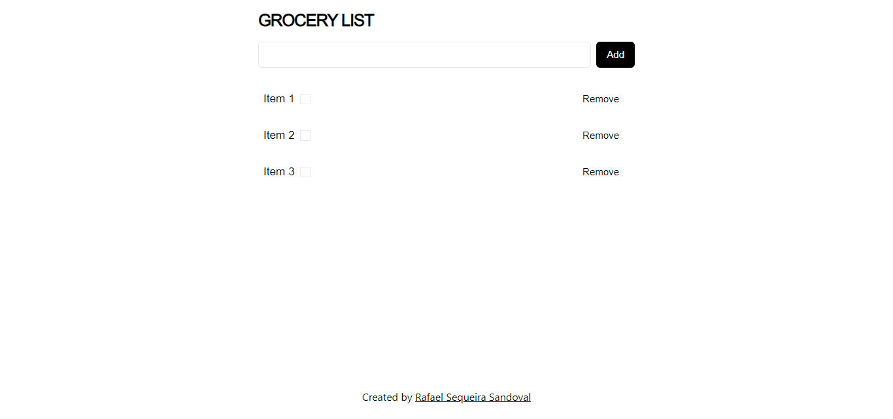

# Grocery list
CRUD simple y minimalista creado con tRPC, Next.js, Prisma, Tailwind y Shadcn/ui

## Proceso de instalación
1. Renombrar el archivo ".env.template" a ".env" y agregar la url de tu base de datos.
2. Ejecutar el comando ```pnpm install``` en la raíz del proyecto para agregar las dependencias necesarias
3. Ejecutar ```pnpm dev``` para levantar el proyecto

## Screenshots

